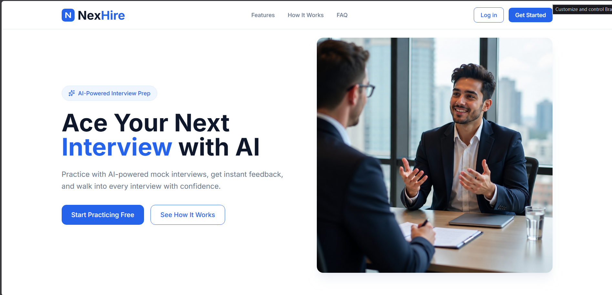
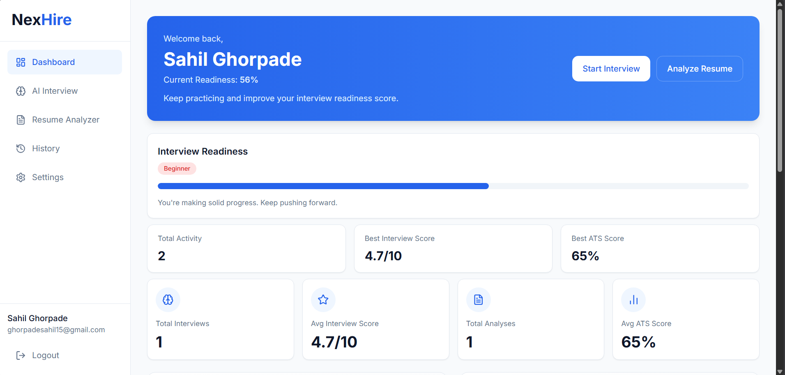
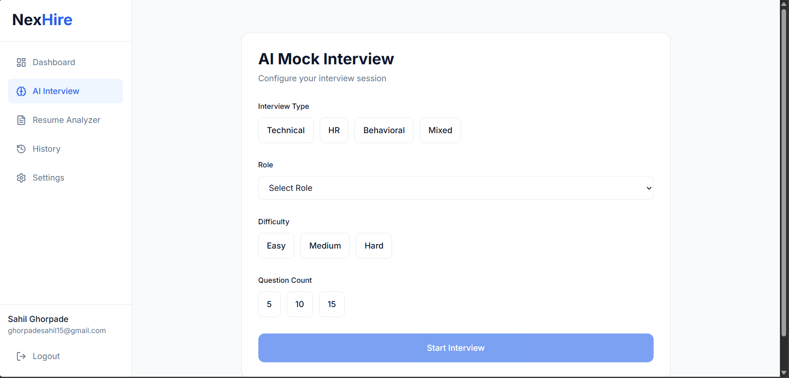
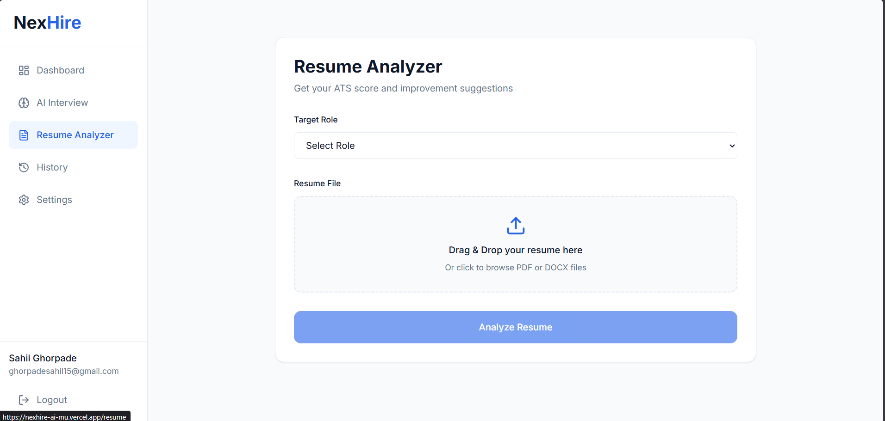
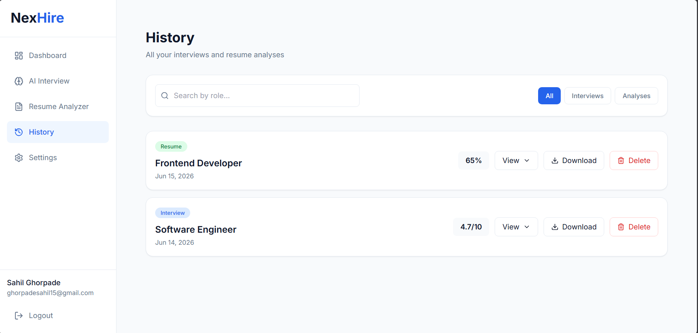

# NexHire

**AI-Powered Interview Preparation Platform**

NexHire helps job seekers prepare for interviews using AI-driven mock interviews and resume analysis. Practice realistic interview questions, get instant feedback and scoring from Google's Gemini AI, and improve your resume's ATS compatibility — all in one place.

🔗 **Live App:** [https://nexhire-ai-mu.vercel.app](https://nexhire-ai-mu.vercel.app)
🔗 **Backend API:** [https://nexhire-backend-zr07.onrender.com](https://nexhire-backend-zr07.onrender.com)

> Note: The backend is hosted on Render's free tier. An uptime monitor pings the server periodically to help keep it active.

---

## Features

### Authentication
- Email + OTP based signup and verification
- Google OAuth (Sign in / Sign up with Google)
- Forgot password flow with OTP verification and secure reset tokens
- JWT-based session management

### AI Mock Interview
- Choose interview type (Technical, HR, Behavioral, Mixed), target role, difficulty, and number of questions
- AI-generated interview questions tailored to the selected role and difficulty
- Timed question sessions (2 minutes per question, auto-skip on timeout)
- AI evaluation of every answer with a 0-10 score and detailed feedback
- For skipped questions, AI provides the ideal answer as a learning aid
- Full report: overall score, attempt rate, strengths, weak areas, recommendations, and a personalized learning path
- Downloadable PDF report

### Resume Analyzer (ATS Score)
- Upload resume as PDF or DOCX
- AI validates that the uploaded file is a genuine resume
- ATS compatibility score (0-100) for a selected target role
- Skills found vs. missing skills
- Strengths, weaknesses, and actionable improvement suggestions
- Downloadable PDF report

### Smart Role Validation
- Three-layer caching system to minimize AI API usage:
  1. Check the user's recently used custom roles
  2. Check a shared, globally validated roles collection
  3. Fall back to Gemini AI only if the role is unrecognized
- Valid custom roles are cached for all future users

### Dashboard
- Welcome overview with an interview readiness score
- Quick stats: total interviews, average interview score, total resume analyses, average ATS score
- Performance charts (bar chart for interview scores, line chart for ATS scores)
- Dynamic, personalized recommendations based on user activity

### History
- Unified, searchable timeline of all interviews and resume analyses
- Filter by type (Interviews / Analyses)
- Expand any entry to view the full report inline
- Delete entries with confirmation
- Download PDF reports directly from history

### Settings
- Edit profile (name, target role, skills)
- Change password (for email/password accounts)
- View connected account type (Email or Google)
- Permanently delete account and all associated data

---

## Tech Stack

**Frontend**
- React (Vite)
- React Router
- Tailwind CSS
- React Hook Form + Zod (validation)
- Recharts (charts)
- Axios
- Lucide React (icons)

**Backend**
- Node.js + Express
- MongoDB with Mongoose
- JWT authentication
- Google Generative AI (Gemini API)
- Multer + pdf-parse + mammoth (resume file processing)
- PDFKit (PDF report generation)
- Brevo API (transactional emails)
- bcryptjs (password hashing)

**Deployment**
- Frontend: Vercel
- Backend: Render
- Database: MongoDB Atlas

---

## Project Structure

```
NexHire/
├── frontend/
│   ├── src/
│   │   ├── api/            # Axios instance
│   │   ├── components/      # Shared components (Sidebar layout, ProtectedRoute)
│   │   ├── context/          # Auth context
│   │   ├── pages/             # All route pages
│   │   ├── utils/             # Helper functions (e.g. PDF download)
│   │   └── App.jsx            # Routes
│   └── ...
│
├── backend/
│   ├── src/
│   │   ├── config/            # Database connection
│   │   ├── models/            # Mongoose models (User, Interview, ResumeAnalysis, ValidRole)
│   │   ├── routes/             # API routes
│   │   ├── controllers/        # Request handlers
│   │   ├── services/            # Business logic (auth, interview, resume, role validation, PDF)
│   │   ├── middleware/           # Auth middleware
│   │   ├── validators/           # Request validation
│   │   ├── utils/                # Email sending, email templates
│   │   └── server.js              # App entry point
│   └── ...
│
└── README.md
```

---

## Getting Started (Local Development)

### Prerequisites
- Node.js (v18 or higher)
- MongoDB Atlas account (or local MongoDB instance)
- Google Gemini API key
- Google OAuth credentials
- Brevo account (for sending emails)

### 1. Clone the repository
```bash
git clone https://github.com/Sahil-Ghorpade/NexHire.git
cd NexHire
```

### 2. Backend Setup
```bash
cd backend
npm install
```

Create a `.env` file inside `backend/` with the following variables:

```
PORT=5000
MONGO_URI=your_mongodb_connection_string
GEMINI_API_KEY=your_gemini_api_key
GOOGLE_CLIENT_ID=your_google_client_id
GOOGLE_CLIENT_SECRET=your_google_client_secret
GMAIL_USER=your_verified_sender_email
BREVO_API_KEY=your_brevo_api_key
JWT_SECRET=your_jwt_secret
CLIENT_URL=http://localhost:5173
```

Run the backend:
```bash
npm run dev
```

### 3. Frontend Setup
```bash
cd ../frontend
npm install
```

Create a `.env` file inside `frontend/` with:

```
VITE_API_URL=http://localhost:5000
VITE_GOOGLE_CLIENT_ID=your_google_client_id
```

Run the frontend:
```bash
npm run dev
```

The app will be available at `http://localhost:5173`.

---

## Screenshots









---

## Future Improvements

- Scheduled cleanup job for unverified user accounts
- Avatar/profile picture upload via cloud storage
- Support for additional interview types and languages
- Rate limiting and abuse protection on AI endpoints

---

## Author

**Sahil Ghorpade**

- LinkedIn: [linkedin.com/in/sahilghorpade](https://www.linkedin.com/in/sahilghorpade/)
- GitHub: [github.com/Sahil-Ghorpade](https://github.com/Sahil-Ghorpade)
- LeetCode: [leetcode.com/u/Nhdui1uvFI](https://leetcode.com/u/Nhdui1uvFI/)

---

## License

This is a personal project built for learning and demonstration purposes. All rights reserved.
